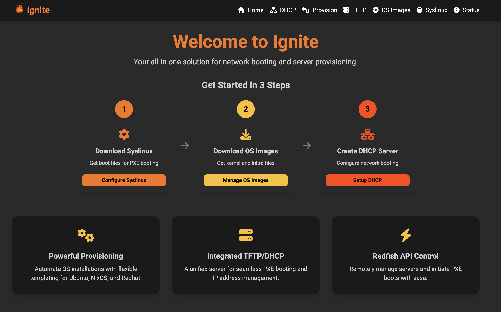
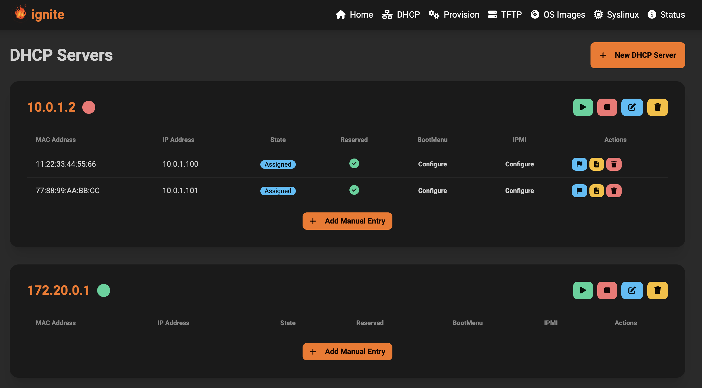

# Ignite

<p align="center">
  
</p>

Ignite is a powerful, all-in-one solution for network booting and server provisioning, implemented in Go. It simplifies the complexities of setting up network boot environments by integrating DHCP, TFTP, and a web-based management interface into a single, easy-to-use application.

## Overview

Designed for developers, system administrators, and hobbyists, Ignite provides a streamlined workflow for managing PXE boot environments. Whether you're deploying operating systems, running diagnostics, or managing server configurations, Ignite offers the tools you need to get the job done efficiently.

## Features

- **Integrated DHCP Server**: Dynamically assign IP addresses to network devices.
- **Built-in TFTP Server**: Serve boot files (e.g., PXELinux, iPXE) to booting clients.
- **Web-Based Management UI**: A user-friendly interface to manage DHCP leases, configure boot menus, and monitor server status.
- **Dynamic PXE Boot Menu Templating**: Automatically generate PXE boot menus for different operating systems based on DHCP leases. Supported templates include:
  - Ubuntu
  - NixOS
  - Red Hat
- **Redfish API Integration**: Remotely manage servers and initiate PXE boot processes via the Redfish API.
- **Cloud-Init & Kickstart Templating**: Simplify automated OS installations with dynamic templating for cloud-init and Kickstart configurations.

## Screenshots

Here's a glimpse of the Ignite web interface:

**Main Page**



**DHCP Page**



## Getting Started

### Prerequisites

- **Go**: Version 1.18 or higher.
- **Node.js & npm**: For managing frontend dependencies.
- **Tailwind CSS**: For styling the web interface.
- A basic understanding of network booting concepts (DHCP, TFTP, PXE).

### Setup

1. **Clone the repository**:

   ```bash
   git clone https://github.com/your-username/ignite.git
   cd ignite
   ```

2. **Build and Run**:

   The easiest way to get started is by using the provided Makefile:

   ```bash
   make run
   ```

   This command will handle installing dependencies, building the CSS, and running the application.

3. **Access the Web UI**:

   Once the server is running, open your browser and navigate to `http://localhost:8080`.

### Configuration

Ignite can be configured via environment variables. Here are the available options:

| Variable    | Description                                    | Default            |
|-------------|------------------------------------------------|--------------------|
| `DB_PATH`   | Path to store the database file.               | `./`               |
| `DB_FILE`   | Name of the database file.                     | `ignite.db`        |
| `DB_BUCKET` | Database bucket name.                          | `dhcp`             |
| `TFTP_DIR`  | Directory for the TFTP server to serve files from. | `./public/tftp`   |
| `HTTP_DIR`  | Directory for the HTTP server to serve files from. | `./public/http`   |
| `HTTP_PORT` | Port for the HTTP server to listen on.         | `8080`             |
| `PROV_DIR`  | Directory for provisioning templates.          | `./public/provision` |

## API Reference

Ignite exposes a set of RESTful APIs to control and manage the server.

### GET Routes

| Endpoint                | Description                              |
|-------------------------|------------------------------------------|
| `/`                     | Serves the main index page.              |
| `/open_modal`           | Opens a modal dialog.                    |
| `/close_modal`          | Closes a modal dialog.                   |
| `/dhcp`                 | Serves the DHCP management page.         |
| `/dhcp/servers`         | Retrieves a list of DHCP servers.        |
| `/status`               | Serves the server status page.           |
| `/provision`            | Serves the provisioning page.            |
| `/tftp`                 | Serves the TFTP management page.         |
| `/tftp/open`            | Opens a file in the TFTP directory.      |
| `/tftp/download`        | Downloads a file from the TFTP directory.|
| `/tftp/view`            | Views a file from the TFTP directory.    |
| `/tftp/serve`           | Serves a file from the TFTP directory.   |
| `/prov/gettemplates`    | Retrieves provisioning template options. |
| `/prov/loadtemplate`    | Loads a provisioning template.           |
| `/prov/getconfigs`      | Retrieves configuration options.         |
| `/prov/loadconfig`      | Loads a configuration file.              |
| `/prov/getfilename`     | Updates the filename for a template.     |

### POST Routes

| Endpoint                  | Description                                   |
|---------------------------|-----------------------------------------------|
| `/dhcp/start`             | Starts a DHCP server.                         |
| `/dhcp/stop`              | Stops a DHCP server.                          |
| `/dhcp/delete`            | Deletes a DHCP server.                        |
| `/dhcp/submit_dhcp`       | Submits a new DHCP server configuration.      |
| `/dhcp/submit_reserve`    | Reserves a DHCP lease.                        |
| `/dhcp/remove_reserve`    | Removes a DHCP lease reservation.             |
| `/dhcp/delete_lease`      | Deletes a DHCP lease.                         |
| `/tftp/delete_file`       | Deletes a file from the TFTP directory.       |
| `/tftp/upload_file`       | Uploads a file to the TFTP directory.         |
| `/pxe/submit_menu`        | Submits a new PXE boot menu.                  |
| `/pxe/submit_ipmi`        | Submits an IPMI command.                      |
| `/prov/newtemplate`       | Creates a new provisioning template.          |
| `/prov/save`              | Saves a provisioning file.                    |

## Contributing

Contributions are welcome! Please feel free to submit a pull request, report an issue, or suggest a feature.

## License

This project is licensed under the MIT License. See the `LICENSE` file for details.

## Acknowledgments

- Inspired by GoPXE.
- User interface built with Tailwind CSS and daisyUI.