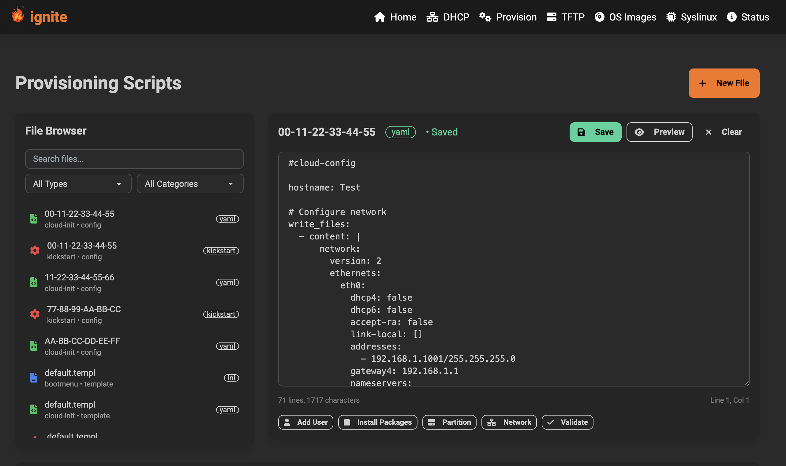
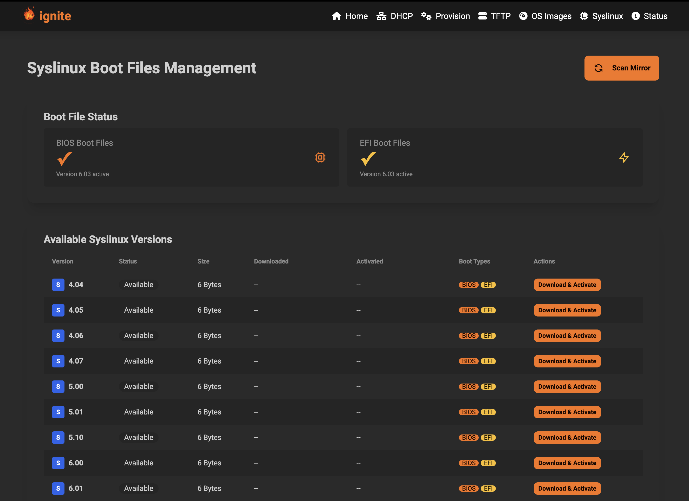

# Ignite

<p align="center">
  
</p>

Ignite is a powerful, all-in-one solution for network booting and server provisioning, implemented in Go. It simplifies the complexities of setting up network boot environments by integrating DHCP, TFTP, and a web-based management interface into a single, easy-to-use application.

## 🏆 Quality & Testing

Ignite features comprehensive test coverage across all components:

- **Comprehensive Unit Tests**: All packages include extensive test suites with mock implementations
- **Integration Testing**: VM-based testing with QEMU for end-to-end PXE boot validation  
- **Test Coverage**: Significant coverage across core packages (osimage, syslinux, handlers, routes, vmtest)
- **Quality Assurance**: Automated formatting (`gofmt`) and static analysis (`go vet`) validation

## Overview

Designed for developers, system administrators, and hobbyists, Ignite provides a streamlined workflow for managing PXE boot environments. Whether you're deploying operating systems, running diagnostics, or managing server configurations, Ignite offers the tools you need to get the job done efficiently.

## Features

- **Integrated DHCP Server**: Dynamically assign IP addresses to network devices.
- **Built-in TFTP Server**: Serve boot files (e.g., PXELinux, iPXE) to booting clients.
- **Web-Based Management UI**: A user-friendly interface to manage DHCP leases, configure boot menus, and monitor server status.
- **Dynamic PXE Boot Menu Templating**: Automatically generate PXE boot menus for different operating systems based on DHCP leases. Supported templates include:
  - Ubuntu
  - NixOS
  - Red Hat
- **Redfish API Integration**: Remotely manage servers and initiate PXE boot processes via the Redfish API.
- **Cloud-Init & Kickstart Templating**: Simplify automated OS installations with dynamic templating for cloud-init and Kickstart configurations.
- **Advanced File Management**: Template and configuration file browser with delete functionality and clear type distinction.
- **Enhanced Security**: Path validation, input sanitization, and secure file operations throughout the application.
- **Comprehensive Error Handling**: Detailed error messages, validation feedback, and graceful error recovery.

## Screenshots

Here's a comprehensive look at the Ignite web interface across all major features:

### **Main Dashboard**
The central hub providing system overview, quick actions, and navigation to all features.


### **DHCP Management** 
Complete DHCP server management with lease monitoring, reservations, and dynamic IP allocation.


### **TFTP File Management**
File browser and management interface for boot files, operating system images, and PXE configurations.


### **Provision Templates**
Cloud-init and Kickstart template editor with syntax highlighting, template management, file deletion, and clear distinction between templates and configs.



### **OS Images Management**
Download, manage, and deploy operating system images with progress tracking and version control.


### **Syslinux Configuration**
Advanced PXE boot menu configuration and SYSLINUX management interface.



### **System Status**
Real-time monitoring of server status, services, and system health indicators.


## Getting Started

### Prerequisites

- **Go**: Version 1.21 or higher (tested with Go 1.23.4).
- **Node.js & npm**: For managing frontend dependencies.
- **Tailwind CSS**: For styling the web interface.
- **QEMU** (optional): For running integration tests (`qemu-system-x86_64`, `qemu-img`).
- **curl**: For API testing and health checks.
- A basic understanding of network booting concepts (DHCP, TFTP, PXE).

### Setup

1. **Clone the repository**:

   ```bash
   git clone https://github.com/your-username/ignite.git
   cd ignite
   ```

2. **Build and Run**:

   The easiest way to get started is by using the provided Makefile:

   ```bash
   make run
   ```

   This command will handle installing dependencies, building the CSS, and running the application.

3. **Access the Web UI**:

   Once the server is running, open your browser and navigate to `http://localhost:8080`.

### Development & Testing

**Running Tests**:

```bash
# Run all unit tests
go test ./...

# Run tests with coverage
go test -cover ./...

# Run vmtest integration tests (requires QEMU)
cd vmtest
go run vmtest.go 1    # Test boot files with QEMU built-in TFTP
go run vmtest.go 2    # Test ignite integration
go run vmtest.go logs # Show test logs
go run vmtest.go clean # Clean up test files
```

**Code Quality**:

```bash
# Format code
gofmt -w .

# Run static analysis
go vet ./...
```

**CLI Options**:

```bash
# Populate with mock data for testing
./ignite -mock-data

# Clear all data
./ignite -clear-data
```

### Configuration

Ignite can be configured via environment variables. Here are the available options:

| Variable    | Description                                    | Default            |
|-------------|------------------------------------------------|--------------------|
| `DB_PATH`   | Path to store the database file.               | `./`               |
| `DB_FILE`   | Name of the database file.                     | `ignite.db`        |
| `DB_BUCKET` | Database bucket name.                          | `dhcp`             |
| `TFTP_DIR`  | Directory for the TFTP server to serve files from. | `./public/tftp`   |
| `HTTP_DIR`  | Directory for the HTTP server to serve files from. | `./public/http`   |
| `HTTP_PORT` | Port for the HTTP server to listen on.         | `8080`             |
| `PROV_DIR`  | Directory for provisioning templates.          | `./public/provision` |

## API Reference

Ignite exposes a set of RESTful APIs to control and manage the server.

### GET Routes

| Endpoint                | Description                              |
|-------------------------|------------------------------------------|
| `/`                     | Serves the main index page.              |
| `/open_modal`           | Opens a modal dialog.                    |
| `/close_modal`          | Closes a modal dialog.                   |
| `/dhcp`                 | Serves the DHCP management page.         |
| `/dhcp/servers`         | Retrieves a list of DHCP servers.        |
| `/status`               | Serves the server status page.           |
| `/provision`            | Serves the provisioning page.            |
| `/tftp`                 | Serves the TFTP management page.         |
| `/tftp/open`            | Opens a file in the TFTP directory.      |
| `/tftp/download`        | Downloads a file from the TFTP directory.|
| `/tftp/view`            | Views a file from the TFTP directory.    |
| `/tftp/serve`           | Serves a file from the TFTP directory.   |
| `/prov/gettemplates`    | Retrieves provisioning template options. |
| `/prov/loadtemplate`    | Loads a provisioning template.           |
| `/prov/getconfigs`      | Retrieves configuration options.         |
| `/prov/loadconfig`      | Loads a configuration file.              |
| `/prov/getfilename`     | Updates the filename for a template.     |
| `/provision/load-file`  | Loads file content via API.              |
| `/provision/gallery`    | Retrieves template gallery items.        |

### POST Routes

| Endpoint                  | Description                                   |
|---------------------------|-----------------------------------------------|
| `/dhcp/create_server`     | Creates a new DHCP server configuration.      |
| `/dhcp/start`             | Starts a DHCP server.                         |
| `/dhcp/stop`              | Stops a DHCP server.                          |
| `/dhcp/delete`            | Deletes a DHCP server.                        |
| `/dhcp/submit_dhcp`       | Submits a new DHCP server configuration.      |
| `/dhcp/submit_reserve`    | Reserves a DHCP lease.                        |
| `/dhcp/remove_reserve`    | Removes a DHCP lease reservation.             |
| `/dhcp/delete_lease`      | Deletes a DHCP lease.                         |
| `/tftp/delete_file`       | Deletes a file from the TFTP directory.       |
| `/tftp/upload_file`       | Uploads a file to the TFTP directory.         |
| `/pxe/submit_menu`        | Submits a new PXE boot menu.                  |
| `/pxe/submit_ipmi`        | Submits an IPMI command.                      |
| `/prov/newtemplate`       | Creates a new provisioning template.          |
| `/prov/save`              | Saves a provisioning file.                    |
| `/provision/save-file`    | Saves file content via API.                   |
| `/provision/delete-file`  | Deletes a file from provision directories.    |

## Architecture

Ignite follows a clean, modular architecture with clear separation of concerns:

### Core Packages

- **`app/`**: Application lifecycle, dependency injection, and service orchestration
- **`dhcp/`**: DHCP server implementation with lease management and reservation support
- **`tftp/`**: TFTP server for serving boot files and OS images
- **`handlers/`**: HTTP request handlers with dependency injection for web API endpoints
- **`routes/`**: HTTP routing configuration and middleware setup
- **`config/`**: Configuration management with environment variable support
- **`db/`**: Database abstraction layer using BoltDB for persistent storage

### Specialized Components

- **`osimage/`**: OS image management with download tracking and file operations
- **`syslinux/`**: SYSLINUX boot file management and menu generation
- **`ipxe/`**: iPXE configuration generation and template rendering
- **`vmtest/`**: Integration testing framework using QEMU for end-to-end PXE testing

### Testing Strategy

- **Unit Tests**: Comprehensive test coverage with mock implementations for all external dependencies
- **Integration Tests**: Real-world testing using QEMU VMs to validate PXE boot workflows
- **Mock Services**: Testify-based mocks for database operations, file system interactions, and external services

## vmtest Integration Testing

The `vmtest/` package provides comprehensive integration testing capabilities:

```bash
cd vmtest
./setup-boot-files.sh    # One-time setup: download SYSLINUX boot files

# Test boot files with QEMU built-in TFTP (validates PXE menu display)
go run vmtest.go 1

# Test full ignite integration (DHCP server, API endpoints, VM boot)
go run vmtest.go 2

# View test results and VM serial output
go run vmtest.go logs

# Clean up test artifacts
go run vmtest.go clean
```

Integration tests validate:
- SYSLINUX boot file functionality
- DHCP server API endpoints
- Ignite web interface responsiveness  
- End-to-end PXE boot workflows
- VM network boot scenarios

## Deployment Options

### **Docker Deployment (Recommended)**

#### **Option 1: Pre-built Image**
```bash
docker run -d \
  --name ignite \
  -p 8080:8080 \
  -p 69:69/udp \
  -v $(pwd)/data:/app/data \
  -v $(pwd)/public:/app/public \
  ghcr.io/chadleeshaw/ignite:v2.0.0
```

#### **Option 2: Build from Source**
```bash
# Full build (requires Go toolchain in container)
docker build -t ignite:local .

# Quick build using release binary (faster, smaller image)
docker build -f Dockerfile.release -t ignite:release .
docker run -d --name ignite -p 8080:8080 -p 69:69/udp ignite:release
```

### **Binary Installation**
```bash
# Download for your platform
wget https://github.com/chadleeshaw/ignite/releases/download/v2.0.0/ignite-linux-amd64
chmod +x ignite-linux-amd64
./ignite-linux-amd64

# Or use the x86_64 variant
wget https://github.com/chadleeshaw/ignite/releases/download/v2.0.0/ignite-x86_64
chmod +x ignite-x86_64
./ignite-x86_64
```

### **Development Setup**
```bash
git clone https://github.com/chadleeshaw/ignite.git
cd ignite
go mod download
go run . -mock-data    # Start with sample data
```

## Recent Improvements ✅

- ✅ **Enhanced error handling and user feedback** - Comprehensive error messages and validation throughout the application
- ✅ **IP address validation for DHCP configurations** - Input sanitization and validation for network configurations
- ✅ **TFTP directory path security improvements** - Path traversal protection and secure file operations
- ✅ **Interface standardization across services** - Consistent API patterns and dependency injection
- ✅ **Additional OS template support** - Extended template gallery with Docker, Kubernetes, and more
- ✅ **File management enhancements** - Delete functionality and template vs config distinction
- ✅ **Code optimization** - Removed unused code, optimized performance, fixed deprecated functions

## Security Model

Ignite uses a simple, network-focused security approach suitable for lab and infrastructure environments:

- **Single Admin Authentication**: Shared login credentials (`admin/admin` by default, changeable via web interface)
- **Network-Level Security**: Designed for deployment on isolated management networks (VLANs, private networks)
- **Session-Based Access**: Simple session management with HTTP-only cookies
- **Path Security**: File operations restricted to designated directories with path traversal protection

## Future Enhancements

- **Advanced monitoring** - Metrics collection and alerting for system health
- **API versioning** - Backward compatibility and gradual migration support
- **Plugin architecture** - Extensible framework for custom integrations
- **Configuration templating** - Variable substitution and environment-specific configs

## Contributing

Contributions are welcome! Please ensure all contributions include:

1. **Comprehensive tests** for new functionality
2. **Code formatting** using `gofmt -w .`
3. **Static analysis** compliance via `go vet ./...`
4. **Documentation updates** for new features or API changes

### Development Workflow

```bash
# Format and validate code
gofmt -w .
go vet ./...

# Run full test suite
go test ./...

# Run integration tests (if QEMU available)
cd vmtest && go test -v

# Build and test the application
go build -o ignite .
./ignite -mock-data  # Test with sample data
```

## License

This project is licensed under the MIT License. See the `LICENSE` file for details.

## Acknowledgments

- Inspired by GoPXE.
- User interface built with Tailwind CSS and daisyUI.
- Frontend help from Google Jules
- Backend help from Claude